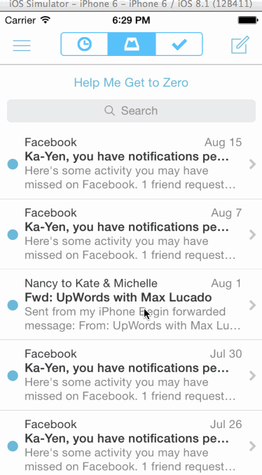

Mailbox
=======

This is an app that imitates the actions you can take on a message in the Mailbox app.

Total time: 9 hours

Completed User Stories

On dragging the message left...
* [x] Initially, the revealed background color should be gray.
* [x] As the reschedule icon is revealed, it should start semi-transparent and become fully opaque. If released at this point, the message should return to its initial position.
* [x] After 60 pts, the later icon should start moving with the translation and the background should change to yellow.
* [x] Upon release, the message should continue to reveal the yellow background. When the animation it complete, it should show the reschedule options.
* [x] After 260 pts, the icon should change to the list icon and the background color should change to brown.
* [x] Upon release, the message should continue to reveal the brown background. When the animation it complete, it should show the list options.
* [x] User can tap to dismissing the reschedule or list options. After the reschedule or list options are dismissed, you should see the message finish the hide animation.

On dragging the message right...
* [x] Initially, the revealed background color should be gray.
* [x] As the archive icon is revealed, it should start semi-transparent and become fully opaque. If released at this point, the message should return to its initial position.
* [x] After 60 pts, the archive icon should start moving with the translation and the background should change to green.
Upon release, the message should continue to reveal the green background. When the animation it complete, it should hide the message.
* [x] After 260 pts, the icon should change to the delete icon and the background color should change to red.
* [x] Upon release, the message should continue to reveal the red background.

GIF created with [LiceCap](http://www.cockos.com/licecap/).
